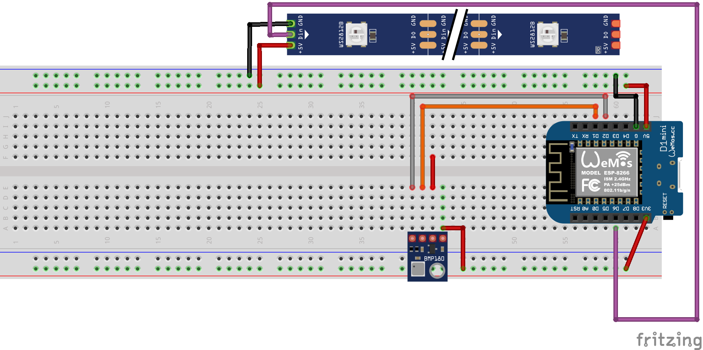
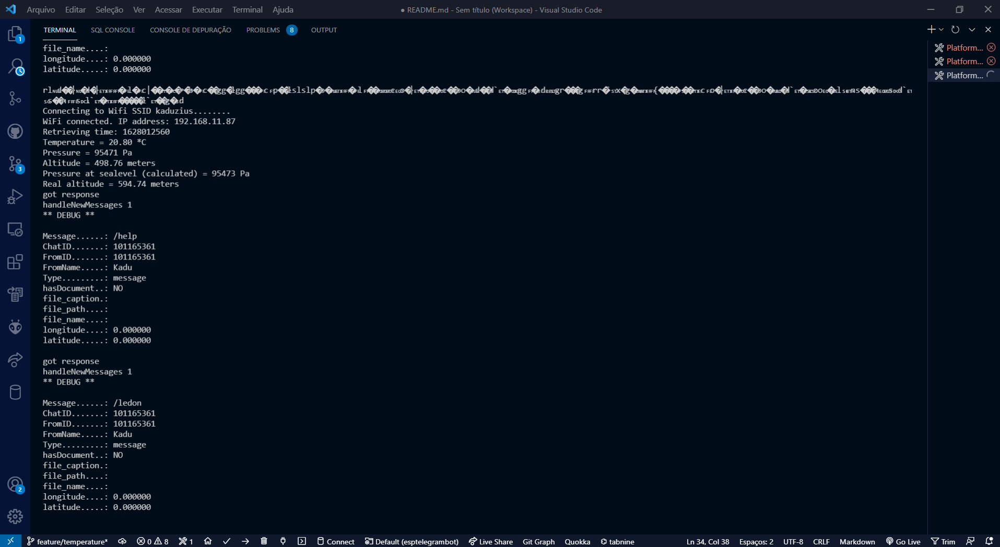
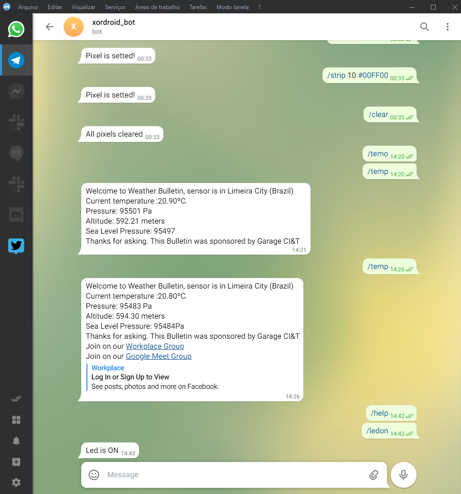

# ESP8266 / ESP32 - Telegram BOT (PT-BR)
English version below

## Demonstração

Bem vindos ao projeto de demonstração dos microcontroladores da Espressif ESP8266 / ESP32.

Nesse projeto vamos testar as capacidades do ESP8266 (NodeMCU) fazendo um BOT para o Telegram. Esse Bot terá uma fita de LED com 72 leds RGBs endereçaveis e um sensor de temperatura (BMP180) e através de comandos enviados para o BOT será possível mudar as cores de um determinado pixel da fita de led e saber qual é a temperatura do local onde o microcontrolador está instalado.

Nesse projeto utilizei o plugin do VSCode PlatformIO, para fazer o gerenciamento das bibliotecas e desenvolvimento e instalação dos firmwares dos microcontroladores.

Caso você queira rodar esse exemplo em um ESP32, será necessário apenas alterar alguns cabeçalhos das bibliotecas de conexão.

## Bibliotecas utilizadas
- Adafruit Neopixel
- Adafruit BMP085
- UniversalTelegramBot
- StringTokenizer

## Arquivo de Segredos (secrets.h)
Existe um arquivo chamado secrets.h contendo os dados secretos do Wifi e o Token do BOT de Telegram

### Conseguindo o seu ID (ChatID)
Algumas funções foram pensadas para ser feitas apenas pelo "dono" do bot, para isso precisamos informar o ChatID do dono do bot, para isso, toda mensagem recebida pelo bot irá mostrar um cabeçalho de debug contendo algumas informações, dentre elas o ChatID, mande uma mensagem e anote esse número no arquivo de segredos e você terá acesso as funções administrativas do bot.

## Reproduzindo o experimento
Você precisará pegar o token para seu bot no telegram, para isso adicione o contato BotFather no seu telegram e siga as instruções para a criação de um novo BOT.

Anote seu token e atualize o arquivo de segredos com suas credenciais.

Adicione o bot criado por você nos seus contatos e então você poderá fazer as chamadas das funções para seu bot.

## Ligações (Wiring)

## Algumas telas do BOT funcionando

# ESP8266 / ESP32 - Telegram BOT (EN)

## Demonstration
Welcome to the Espressif ESP8266 / ESP32 microcontroller demonstration project.

In this project, we will test the capabilities of ESP8266 (NodeMCU) making a BOT for Telegram. This Bot will have an LED strip with 72 addressable RGB LEDs and a temperature sensor (BMP180) and through commands sent to the BOT, it will be possible to change the colors of a certain pixel on the LED strip and know what is the temperature of the place where the microcontroller is installed.

In this project, I used the VSCode PlatformIO plugin to manage the libraries and development and installation of microcontroller firmware.

If you want to run this example on an ESP32, you will only need to change some headers in the connection libraries.

## Libraries used
- Adafruit Neopixel
- Adafruit BMP085
- UniversalTelegramBot
- StringTokenizer
## Secrets file

There is a file called secrets.h containing the secret Wifi data and the Telegram BOT Token

## Getting your ID (ChatID)
Some functions were designed to be done only by the "owner" of the bot, for that we need to inform the ChatID of the bot owner, for that, every message received by the bot will show a debug header containing some information, among them the ChatID, send a message and note this number in the secrets file and you will have access to the bot's administrative functions.
## Reproducing the experiment
You will need to get the token for your bot on the telegram, for that add the BotFather contact to your telegram, and follow the instructions for creating a new BOT.

Write down your token and update the secret file with your credentials.

Add the bot created by you to your contacts and then you can make function calls to your bot.

## Wiring

## Some BOT screens working

